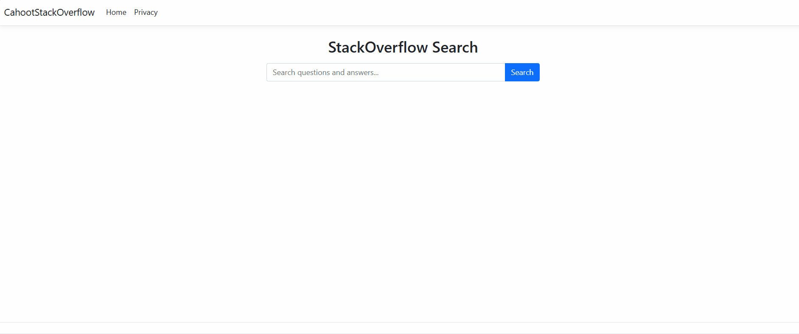

# 🚀 Cahoot StackOverflow Assessment

## 🛠️ How to Run the Project

1. **Database Setup:** I assume you already have the `StackOverflow2010` database attached to your local SQL Server.
2. **Run the Indexes:** Before running the app, please execute the `Indexes.sql` file (located in the `SQL_Scripts` folder) on your database to ensure the search queries run efficiently.
3. **Connection String:** Open the `appsettings.json` file in the ASP.NET project. Update the `DefaultConnection` string to match your local SQL Server instance name. It is currently set to:
   `Server=.;Database=StackOverflow2010;Trusted_Connection=True;TrustServerCertificate=True;`
4. **Run the App:** Open the `CahootStackOverflow.sln` file in Visual Studio 2022 and press the green Play button (or run `dotnet run` from the terminal).

---

## 📊 Project Development Report: High-Performance Database Application

### 1. Database Architecture & Connectivity
* **Setup and Assumptions:** The project utilizes a 10GB SQL Server database (MDF/LDF files) attached to a local SQL Server Express instance. To ensure the download remained manageable, the source database only included basic clustered indexes.
* **Optimization Strategy:** Because the database lacked non-clustered or full-text indexes, initial search performance was slow. For connectivity, I chose **Dapper** over Entity Framework. This decision was based on Dapper's superior speed and the ability to write optimized, native SQL queries for better performance.

### 2. SQL Logic and Data Integrity
* **Data Transformation:** To improve readability, I used SQL `CASE` statements to translate numeric IDs into descriptive terms, such as converting `PostTypeId` values into "Question" or "Answer."
* **Accuracy and Stability:** To maintain data integrity during complex joins, I used `COUNT(DISTINCT p.Id)` to prevent over-counting rows. Additionally, I implemented `NULLIF` logic to prevent application crashes caused by division-by-zero errors in voting calculations.

### 3. Major Challenges and Technical Solutions
* **Challenge: Data Duplication in Weekly Reports** Joining multiple large tables (Posts, Votes, and Users) simultaneously created millions of duplicate rows. I solved this by using **Common Table Expressions (CTEs)** to pre-aggregate data before the final join, ensuring mathematical accuracy.
* **Challenge: Search Timeouts** Searching 10GB of raw text using `LIKE '%term%'` initially caused system timeouts. To address this within the 12-hour project limit, I implemented two major fixes:
  1. Created non-clustered indexes on `CreationDate` and `PostTypeId`.
  2. Pivoted the search logic to target the `Title` column of Questions specifically.
  
  > **Result:** These architectural changes reduced search times from 3+ minutes down to under 1 second.

### 4. Frontend Features and Limitations
* **Efficient Data Loading:** I used SQL `OFFSET` and `FETCH NEXT` to implement pagination, loading only 10 results at a time to save memory. A JavaScript-driven "Load More" button allows for smooth, progressive loading without refreshing the page.
* **Notifications:** The application includes a browser-based Notification API. To prevent user annoyance, I used `sessionStorage` to ensure the notification appears only once per visit. 
* **HTML Limitation:** One known limitation is the truncation of HTML content; currently, cutting text to 140 characters may break HTML tags. This was managed using ASP.NET encoding due to time constraints. In a production environment, a dedicated HTML parser would be used to strip tags before truncation.

### 5. Project Scope and Final Decisions
Given the timeframe, I prioritized application stability and search performance over extra credit features like cross-device login via the Credential Management API. My primary goal was to deliver a fast, reliable, and optimized engine that functions correctly under heavy data loads without introducing authentication middleware overhead.
